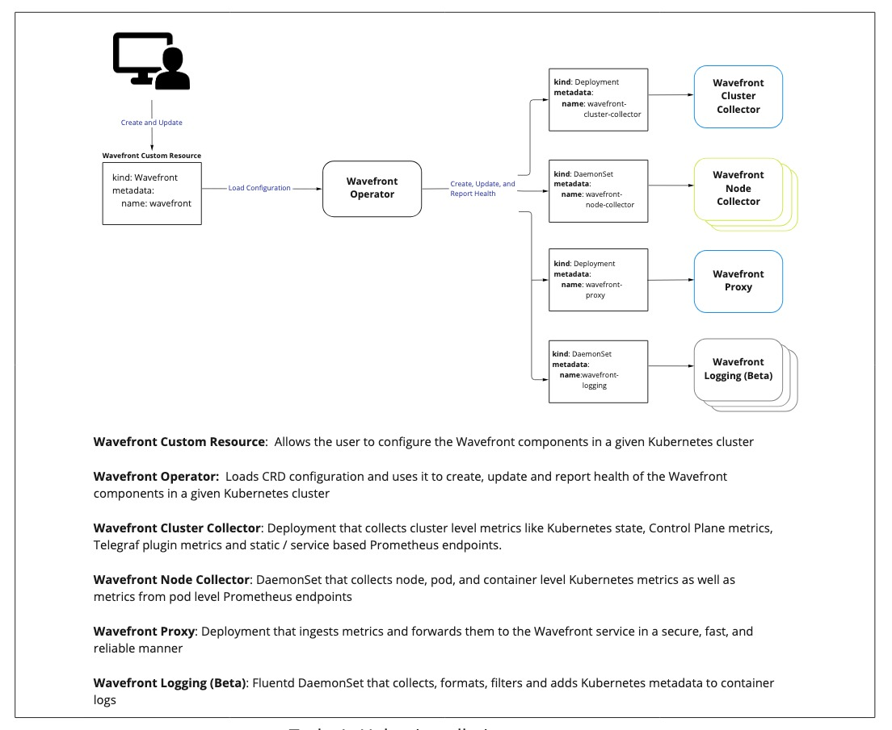

## Initial Availability Notice

This project is in the initial availability phase.
It is suitable for production usage.

**Important:** Observability Logs (Beta) is enabled only for selected customers. If you’d like to participate, contact your Observability account representative.

# Overview of Wavefront Operator for Kubernetes

The Wavefront Operator for Kubernetes
supports deploying the Wavefront Collector and the Wavefront Proxy in Kubernetes.
This operator is based on [kubebuilder SDK](https://book.kubebuilder.io/).

## Quick Reference
- [Operator Installation](#installation)
- [Operator Configuration](#configuration)
- [Operator Upgrade](#upgrade)
- [Operator Downgrade](#downgrade)
- [Operator Removal](#removal)

## Why use the Wavefront Operator for Kubernetes?

The operator simplifies operational aspects of managing the Wavefront integration. Here are some examples, with more to come!
 - Enhanced status reporting of the Wavefront integration so that users can ensure their cluster and Kubernetes resources are reporting data.
 - Kubernetes Operator features provide a declarative mechanism for deploying the Wavefront Collector and proxy in a Kubernetes environment.
 - Centralized configuration.
 - Enhanced configuration validation to surface what needs to be corrected in order to deploy successfully.
 - Efficient Kubernetes resource usage supports scaling  out the cluster (leader) node and worker nodes independently.

**Note:** The Collector that is deployed by the Operator still supports configuration via configmap.
For example, Istio and MySQL metrics, Telegraf configuration, etc. are still supported.

## Architecture



# Installation

**Note:**  The Wavefront Operator for Kubernetes helm chart has been deprecated and is no longer supported. Use the deploy, upgrade and removal instructions below instead.

## Prerequisites

The following tools are required for installing the integration.
- [kubectl](https://kubernetes.io/docs/tasks/tools/)


## Deploy the Wavefront Collector and Proxy with the Operator

1. Install the Wavefront Operator into `observability-system` namespace.

   **Note**: If you already have Wavefront installed via helm or manual deploy, *uninstall* before you install the operator.
 
   ```
   kubectl apply -f https://raw.githubusercontent.com/wavefrontHQ/wavefront-operator-for-kubernetes/main/deploy/kubernetes/wavefront-operator.yaml
   ```

2. Create a Kubernetes secret with your Wavefront token.
   See [Managing API Tokens](https://docs.wavefront.com/wavefront_api.html#managing-api-tokens) page.
   ```
   kubectl create -n observability-system secret generic wavefront-secret --from-literal token=YOUR_WAVEFRONT_TOKEN
   ```
3. Create a `wavefront.yaml` file with your Wavefront Custom Resource configuration.  The simplest configuration is:
   ```yaml
   # Need to change YOUR_CLUSTER_NAME and YOUR_WAVEFRONT_URL
   apiVersion: wavefront.com/v1alpha1
   kind: Wavefront
   metadata:
     name: wavefront
     namespace: observability-system
   spec:
     clusterName: YOUR_CLUSTER_NAME
     wavefrontUrl: YOUR_WAVEFRONT_URL
     dataCollection:
       metrics:
         enable: true
     dataExport:
       wavefrontProxy:
         enable: true
   ```
   See the [Configuration](#configuration) section below for details.

4. (Logging Beta) **Optionally** add the configuration for logging to the `wavefront.yaml` file. For example: 

   ```yaml
   # Need to change YOUR_CLUSTER_NAME, YOUR_WAVEFRONT_URL accordingly
   apiVersion: wavefront.com/v1alpha1
   kind: Wavefront
   metadata:
     name: wavefront
     namespace: observability-system
   spec:
     clusterName: YOUR_CLUSTER_NAME
     wavefrontUrl: YOUR_WAVEFRONT_URL
     dataCollection:
       metrics:
         enable: true
       logging:
         enable: true
     dataExport:
       wavefrontProxy:
         enable: true
   ```
   See [Logs Overview (Beta)](https://docs.wavefront.com/logging_overview.html) for an overview and some links to more doc about the logging beta. 

5. Deploy the Wavefront Collector and Proxy with your configuration
   ```
   kubectl apply -f <path_to_your_wavefront.yaml>
   ```
6. Run the following command to get status for the Wavefront integration:
   ```
   kubectl get wavefront -n observability-system
   ```
   The command should return a table like the following, displaying Operator instance health:
   ```
   NAME        STATUS    PROXY           CLUSTER-COLLECTOR   NODE-COLLECTOR   LOGGING        AGE    MESSAGE
   wavefront   Healthy   Running (1/1)   Running (1/1)       Running (3/3)    Running (3/3)  2m4s   All components are healthy
   ```
   If `STATUS` is `Unhealthy`, check [troubleshooting](docs/troubleshooting.md).

**Note**: For details on migrating from existing helm chart or manual deploy, see [Migration](docs/migration.md).

# Configuration

You configure the Wavefront Operator with a custom resource file.

When you update the resource file,
the Operator picks up the changes and updates the integration deployment accordingly.

To update the custom resource file:
- Open the custom resource file for edit.
- Change one or more options and save the file.
- Run `kubectl apply -f <path_to_your_config_file.yaml>`.

See below for configuration options.

We have templates for common scenarios. See the comments in each file for usage instructions.

 * [Using an existing collector ConfigMap](./deploy/kubernetes/scenarios/wavefront-collector-existing-configmap.yaml)
 * [With plugin configuration in a secret](./deploy/kubernetes/scenarios/wavefront-collector-with-plugin-secret.yaml)
 * [Filtering metrics upon collection](./deploy/kubernetes/scenarios/wavefront-collector-filtering.yaml)
 * [Defining Kubernetes resource limits](./deploy/kubernetes/scenarios/wavefront-pod-resources.yaml)
 * [Defining data collection pod tolerations](./deploy/kubernetes/scenarios/wavefront-daemonset-pod-tolerations.yaml)
 * [Defining proxy pre-processor rules](./deploy/kubernetes/scenarios/wavefront-proxy-preprocessor-rules.yaml)
 * [Enabling proxy histogram support](./deploy/kubernetes/scenarios/wavefront-proxy-histogram.yaml)
 * [Enabling proxy tracing support](./deploy/kubernetes/scenarios/wavefront-proxy-tracing.yaml)
 * [Using an HTTP Proxy](./deploy/kubernetes/scenarios/wavefront-proxy-with-http-proxy.yaml)
 * [Getting started with logging configuration](./deploy/kubernetes/scenarios/wavefront-logging-getting-started.yaml)
 * [Full logging configuration](./deploy/kubernetes/scenarios/wavefront-logging-full-config.yaml)

You can see all configuration options in the [wavefront-full-config.yaml](./deploy/kubernetes/scenarios/wavefront-full-config.yaml).

# Upgrade

Upgrade the Wavefront Operator (both Collector and Proxy) to a new version by running the following command :

```
kubectl apply -f https://raw.githubusercontent.com/wavefrontHQ/wavefront-operator-for-kubernetes/main/deploy/kubernetes/wavefront-operator.yaml
```

Note: This command will not upgrade any existing wavefront/wavefront helm installation. See [migration.md](./docs/migration.md) for migration instructions.

# Downgrade

Go to [Releases](https://github.com/wavefrontHQ/wavefront-operator-for-kubernetes/releases), and find the previous release version number, for example v2.0.3. Replace the **PREVIOUS_VERSION** 
in the following command:

```

kubectl apply -f https://github.com/wavefrontHQ/wavefront-operator-for-kubernetes/releases/download/PREVIOUS_VERSION/wavefront-operator.yaml
```

# Removal

To remove the Wavefront Integration from your environment, run the following commands:

```
kubectl delete -f https://raw.githubusercontent.com/wavefrontHQ/wavefront-operator-for-kubernetes/main/deploy/kubernetes/wavefront-operator.yaml
```

# Contribution

See the [Contribution page](docs/contribution.md)
