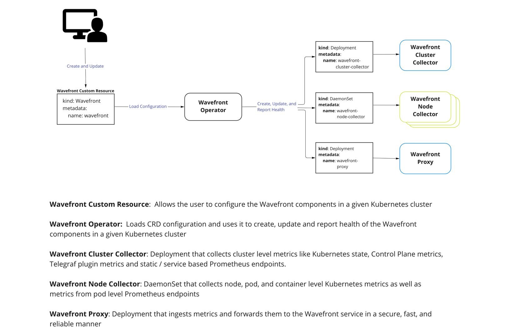

## Beta Notice

This project is in the beta phase and not ready for use on production environments.
For use on production environments,
refer to the Installation and Configuration sections of the [collector repo](https://github.com/wavefrontHQ/wavefront-collector-for-kubernetes)
for our original, more established processes.


# Overview of Wavefront Operator for Kubernetes

The Wavefront Operator for Kubernetes
supports deploying the Wavefront Collector and the Wavefront Proxy in Kubernetes.
This operator is based on [kubebuilder SDK](https://book.kubebuilder.io/).

## Quick Reference
- [Operator Installation](#installation)
- [Operator Validation](#validation)
- [Operator Configuration](#configuration)
- [Operator Upgrade](#upgrade)
- [Operator Removal](#removal)

## Why use the Wavefront Operator for Kubernetes

The operator seeks to simplify a number of operational aspects of managing the Wavefront Integration in Kubernetes. The following are some current examples, with more to come!

- Enhanced status reporting of the Kubernetes Integration to ensure that users can be proactive in ensuring their cluster and Kubernetes resources are reporting data.
- Leveraging Kubernetes Operator features to provide a more declarative mechanism for how the wavefront collector and proxy should be deployed in a Kubernetes Environment.
- Centralizing the configuration of the integration for simpler configuration of the collector and proxy.
- Providing enhanced configuration validation to reduce configuration errors and surface what needs to be corrected in order to deploy successfully.
- Enabling efficient Kubernetes resource usage by being able to scale out the cluster (leader) node and worker nodes independently.
- Providing a unified installation mechanism and form factor across VMware Tanzu product lines to ensure that users have a consistent deployment and configuration experience when deploying the Kubernetes collector and proxy.

**Note:** the collector deployed by the Operator is still a full-feature Wavefront Integration.
This list documents how the Operator extends the integration
with the goal of providing a better user experience.
For example, Istio and MySQL metrics, Telegraf configuration, etc.
are still supported.

## Architecture



# Installation

## Prerequisites

You will need the following tools installed to install the Wavefront Integration
- [kubectl](https://kubernetes.io/docs/tasks/tools/)
- [Helm 3](https://helm.sh/docs/intro/install/) installation

## Deploy the Wavefront Collector and Proxy with the Operator
1. Install the Wavefront Operator
    ```
    helm repo add wavefront-v2beta https://projects.registry.vmware.com/chartrepo/tanzu_observability
    helm repo update
   
    kubectl create namespace wavefront
    
    helm install wavefront-v2beta wavefront-v2beta/wavefront-v2beta --namespace wavefront
    ```
2. Create a Kubernetes secret with your Wavefront Token
    ```
    kubectl create -n wavefront secret generic wavefront-secret --from-literal token=YOUR_WAVEFRONT_TOKEN
    ```
3. Create a file with your Wavefront Custom Resource configuration.  The simplest configuration is:
    ```yaml 
    # Need to change YOUR_CLUSTER_NAME, YOUR_WAVEFRONT_URL accordingly
    apiVersion: wavefront.com/v1alpha1
    kind: Wavefront
    metadata:
      name: wavefront
      namespace: wavefront
    spec:
      clusterName: YOUR_CLUSTER_NAME
      wavefrontUrl: YOUR_WAVEFRONT_URL
      dataCollection:
        metrics:
          enable: true
      dataExport:
        wavefrontProxy:
          enable: true
    ```
4. Deploy the Wavefront Collector and Proxy with the above configuration
    ```
    kubectl apply -f /path/to/your/wavefront.yaml
    ```
See [Configuration](#configuration) section below to learn about additional Custom Resource Configuration.

**Note**: For migrating from existing helm chart or manual deploy, see [Migration](docs/migration.md) for more information.

# Validation

## Component Status

To get status on the Wavefront Integration from the command line, run the following command.
```
kubectl get wavefront -n wavefront
```

It should return the following table displaying Operator instance health:
```
NAME         HEALTHY      WAVEFRONT PROXY     CLUSTER COLLECTOR      NODE COLLECTOR       AGE
wavefront      true          Running(1/1)        Running (1/1)        Running (3/3)      19h
```


# Configuration

The Wavefront Operator is configured via a custom resource. When the resource is updated, the operator will pick up the changes and update the integration deployment accordingly. To update the custom resource, change the option you want in the the wavefront custom resource file and run `kubectl apply -f <your config file>.yaml`. See below for configuration options.

We have templates for common scenarios. See the comments in each file for usage instructions.

 * [Using an existing collector ConfigMap](./deploy/kubernetes/scenarios/wavefront-collector-existing-configmap.yaml)
 * [Filtering metrics upon collection](./deploy/kubernetes/scenarios/wavefront-collector-filtering.yaml)
 * [Defining Kubernetes resource limits](./deploy/kubernetes/scenarios/wavefront-pod-resources.yaml)
 * [Defining proxy pre-processor rules](./deploy/kubernetes/scenarios/wavefront-proxy-preprocessor-rules.yaml)
 * [Enabling proxy histogram support](./deploy/kubernetes/scenarios/wavefront-proxy-histogram.yaml)
 * [Enabling proxy tracing support](./deploy/kubernetes/scenarios/wavefront-proxy-tracing.yaml)
 * [Using an HTTP Proxy](./deploy/kubernetes/scenarios/wavefront-proxy-with-http-proxy.yaml)


If you would like to see all configuration options, see [wavefront-full-config.yaml](./deploy/kubernetes/scenarios/wavefront-full-config.yaml).

# Upgrade

Upgrade Wavefront Operator to a new version

```
helm upgrade wavefront-v2beta wavefront-v2beta/wavefront-v2beta --namespace wavefront
```

Note: This will not upgrade any existing wavefront/wavefront helm installation. See [migration.md](./docs/migration.md) for instructions on how to migrate.

# Removal

To remove the Wavefront Integration from your environment, use the following helm command.

```
helm uninstall wavefront-v2beta -n wavefront
kubectl delete namespace wavefront
```

# Contribution 

See the [Contribution page](docs/contribution.md)
